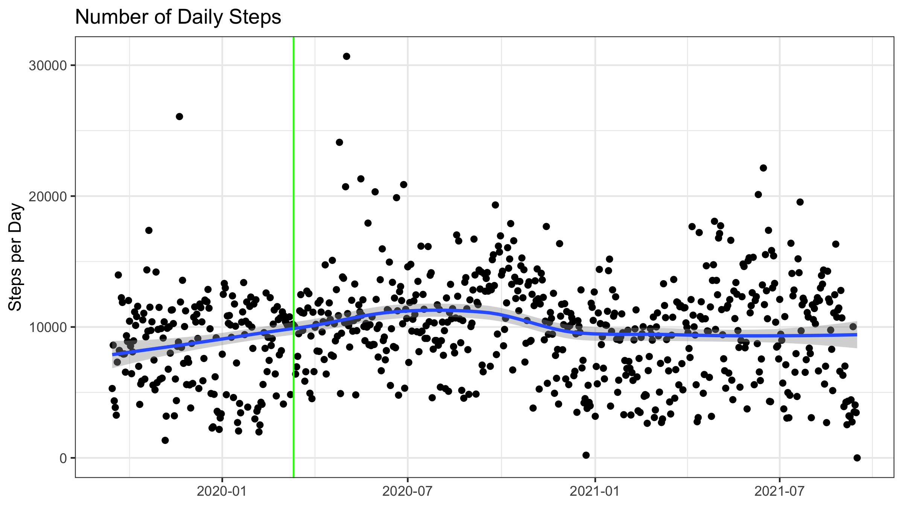
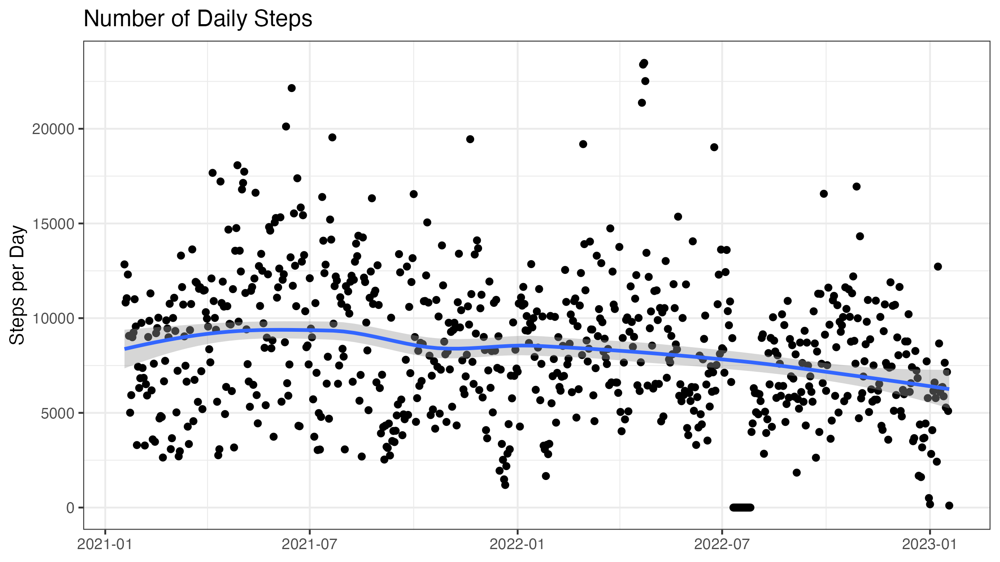
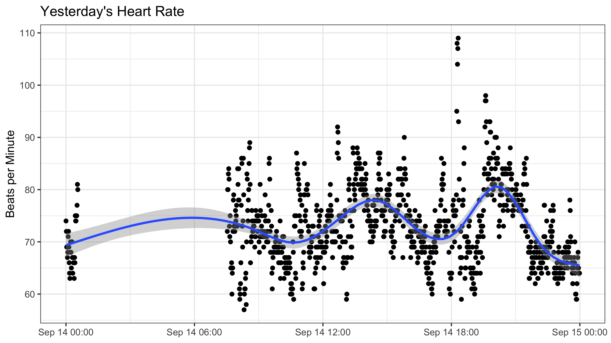
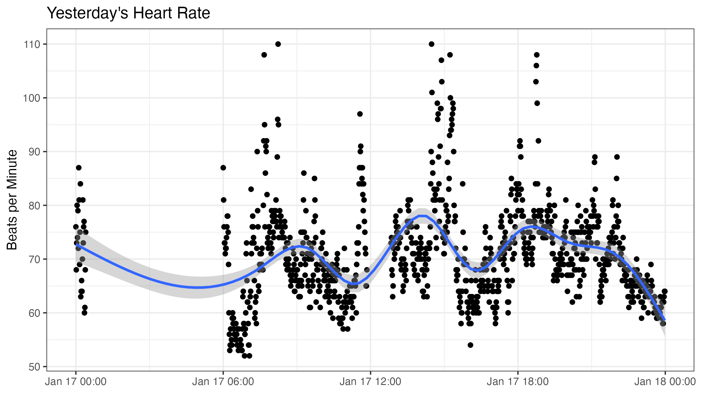
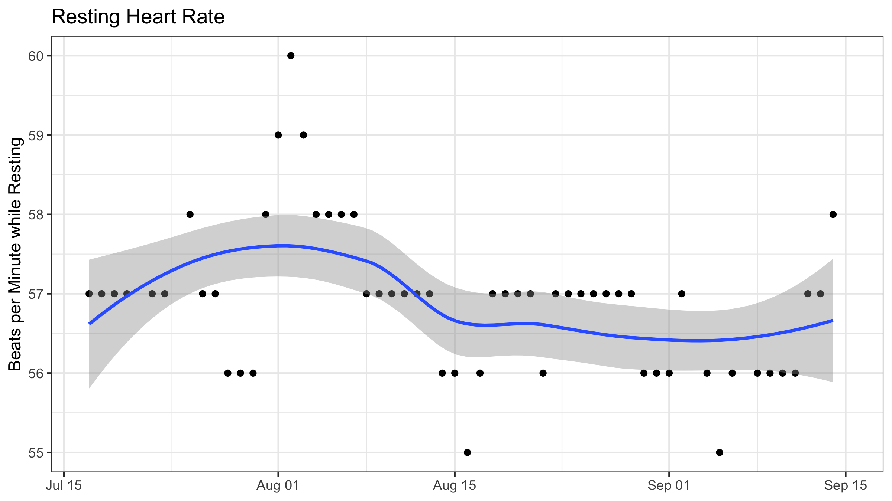
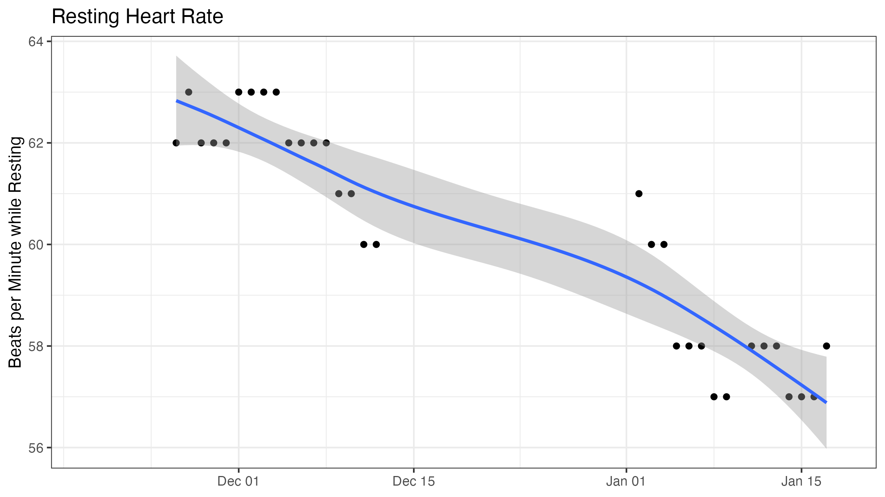
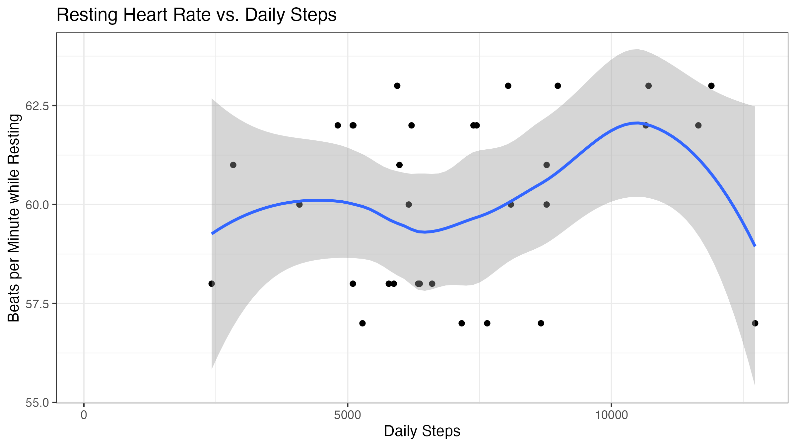
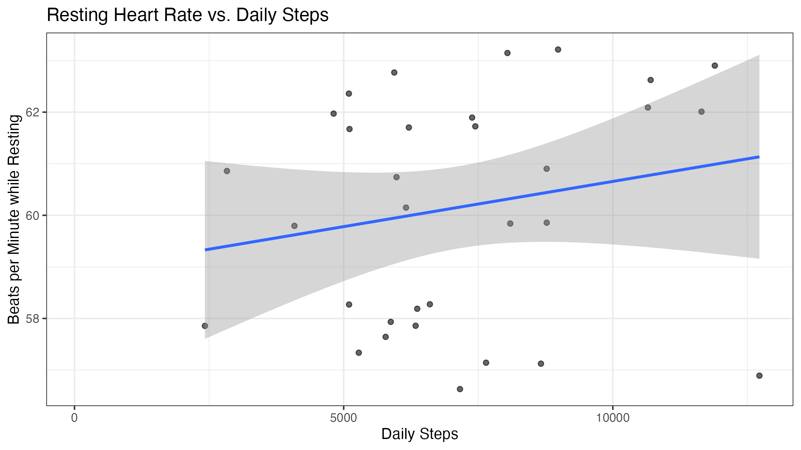

```{r setup, include=FALSE}
options(htmltools.dir.version = FALSE)

library(knitr)
library(tidyverse)
library(xaringan)
library(fontawesome)
library(fitbitr)
```

class: inverse, center, middle

# `r fa("fas fa-heart-pulse", fill = "#fff")` <br><br> **Part 2:** <br> Fitbit

---

class: inverse, center, middle

# `r fa("fas fa-heart-pulse", fill = "#fff")` <br><br> Setup <br> with Fitbit API

### Step 1: Register a Fitbit developer app

This health assessment utilizes the {fitbitr} R package ([Kaye, 2021](https://mrkaye97.github.io/fitbitr/)). The functions in the package are relatively straightforward, but getting access to the [Fitbit API](https://dev.fitbit.com/build/reference/web-api/) set up is a bit tricky. 

---

class: inverse, center, middle

# `r fa("fas fa-heart-pulse", fill = "#fff")` <br><br> Setup <br> with Fitbit API

### Step 1: Register a Fitbit developer app

The first thing to do is register a new Fitbit developer app at [dev.fitbit.com](https://dev.fitbit.com/apps/new).

---

# `r fa("fas fa-heart-pulse", fill = "#fff")` Setup with Fitbit API

### Step 1: Register a Fitbit developer app

Here's how I completed the form:

<hr>

- **Application Name:** `r-health-tracker`
- **Description:** `fitbitr script`
- **Application Website URL:** `https://github.com/bretsw/fitbit` (replace with your GitHub repo)
- **Organization:** `bretsw` (replace with your GitHub user name)
- **Organization Website URL:** `https://github.com/bretsw/fitbit` (replace with your GitHub repo)
- **Terms of Service URL:** `https://github.com/bretsw/fitbit` (replace with your GitHub repo)
- **Privacy Policy URL:** `https://github.com/bretsw/fitbit` (replace with your GitHub repo)
- **OAuth 2.0 Application Type:** `Personal`
- **Redirct URL:** `http://localhost:1410/`
- **Default Access Type:** `Read Only`

---

# `r fa("fas fa-heart-pulse", fill = "#fff")` Setup with Fitbit API

### Step 1: Register a Fitbit developer app

I got a warning from the dev website that the redirect URL needs to be an `https`, but it needs to be in the exact format I have above, because this is how R is set up to take you back to your R console. If you have to, complete the initial form with `https://localhost:1410/` initially, then go back and edit it before you run your R script.

Once you submit your Fitbit dev app, you will be taken to a webpage that lists your **OAuth 2.0 Client ID** and **Client Secret**. 

---

class: inverse, center, middle

# `r fa("fas fa-heart-pulse", fill = "#fff")` <br><br> Setup <br> with Fitbit API

### Step 2: Record your dev app credentials

---

# `r fa("fas fa-heart-pulse", fill = "#fff")` Setup with Fitbit API

### Step 2: Record your dev app credentials

Be sure to make a copy of your Fitbit dev app **OAuth 2.0 Client ID** and **Client Secret**. I find it easiest to securely store these in my local R user environment. You can open this file with the command `usethis::edit_r_environ()` and then retrieve stored variables with `Sys.getenv()`. 

In my R script below, note that you should save your credentials in the form `FITBIT_CLIENT_ID = XXXXXX` and `FITBIT_CLIENT_SECRET = XXXXXX`.

Once you have your credentials stored, close the .Renviron file and quit out of R entirely. When you restart R, your credentials are ready to go. You can check if things are stored correctly by running: `Sys.getenv('FITBIT_CLIENT_ID')` and `Sys.getenv('FITBIT_CLIENT_SECRET')`.

Just be sure that you don't share these credentials with anyone!

---

class: inverse, center, middle

# `r fa("fas fa-heart-pulse", fill = "#fff")` <br><br> Setup <br> with Fitbit API

### Step 3: Retrieve your Fitbit data

---

# `r fa("fas fa-heart-pulse", fill = "#fff")` Setup with Fitbit API

### Step 3: Retrieve your Fitbit data

```{r, message=FALSE, eval=FALSE}
generate_token(client_id = Sys.getenv('FITBIT_CLIENT_ID'), 
               client_secret = Sys.getenv('FITBIT_CLIENT_SECRET')
)
```

---

class: inverse, center, middle

# `r fa("fas fa-otter", fill = "#fff")` <br><br> Try it Out! 

---

# `r fa("fas fa-otter", fill = "#fff")` Try it Out!

What do you think this code will do?

```{r, eval=FALSE}
start_date <- lubridate::today() - lubridate::years(2)
end_date <- lubridate::today()

steps_df <- steps(start_date, end_date)

write_csv(steps_df, "data/fitbit-steps.csv")
```

---

# `r fa("fas fa-otter", fill = "#fff")` Try it Out!

### Look at your daily steps

```{r, include=FALSE, message=FALSE}
steps_df <- read_csv("data/fitbit-steps.csv")
```

```{r}
glimpse(steps_df)
```

---

# `r fa("fas fa-otter", fill = "#fff")` Picture it!

```{r, message=FALSE, warning=FALSE, out.width="33%", fig.align="center"}
ggplot(steps_df, aes(x=date, y=steps)) +
  geom_point() +
  geom_smooth() +
  geom_vline(aes(xintercept = as.Date("2020-03-11")), color = 'green') + 
  xlab(NULL) +
  ylab("Steps per Day") +
  ggtitle("Number of Daily Steps") +
  theme_bw()
```

```{r, include=FALSE, eval=FALSE}
ggsave(file="output/2-daily-steps.png", width=8, height=4.5)
```

---

# `r fa("fas fa-otter", fill = "#fff")` Compare!

```{r, out.width="49%", echo=FALSE, fig.align="center"}

```

```{r, out.width="49%", echo=FALSE, fig.align="center"}

```

---

# `r fa("fas fa-otter", fill = "#fff")` Try it Out!

What do you think this code will do?

```{r, eval=FALSE}
hr <- heart_rate_intraday(lubridate::today() - 1)

write_csv(hr, "data/fitbit-hr.csv")
```

---

# `r fa("fas fa-otter", fill = "#fff")` Try it Out!

### Look at yesterday's heart rate

```{r, include=FALSE, message=FALSE}
hr <- read_csv("data/fitbit-hr.csv")
```

```{r}
glimpse(hr)
```
---

# `r fa("fas fa-otter", fill = "#fff")` Picture it!

```{r, message=FALSE, warning=FALSE, out.width="33%", fig.align="center"}
ggplot(hr, aes(x=time, y=heart_rate)) +
  geom_point() +
  geom_smooth() +
  xlab(NULL) +
  ylab("Beats per Minute") +
  ggtitle("Yesterday's Heart Rate") +
  theme_bw()
```

```{r, include=FALSE, eval=FALSE}
ggsave(file="output/2-yesterday-heart-rate.png", width=8, height=4.5)
```

---

# `r fa("fas fa-otter", fill = "#fff")` Compare!

```{r, out.width="49%", echo=FALSE, fig.align="center"}

```

```{r, out.width="49%", echo=FALSE, fig.align="center"}

```

---

# `r fa("fas fa-otter", fill = "#fff")` Try it Out!

What do you think this code will do?

```{r, eval=FALSE}
yesterday_df <- activity_summary(lubridate::today() - 1)

write_csv(yesterday_df, "data/fitbit-yesterday-df.csv")
```

---

# `r fa("fas fa-otter", fill = "#fff")` Try it Out!

```{r, include=FALSE, message=FALSE}
yesterday_df <- read_csv("data/fitbit-yesterday-df.csv")
```

```{r}
glimpse(yesterday_df)
```

---

# `r fa("fas fa-otter", fill = "#fff")` Try it Out!

What do you think this code will do?

```{r, eval=FALSE, message=FALSE, warning=FALSE}
health_df = NULL

for (i in 0:60) {
  new_row =
    tibble(date = lubridate::today() - i,
           resting_hr = activity_summary(date)$resting_heart_rate,
           steps = activity_summary(date)$steps
           )
  health_df <-
    health_df %>%
    bind_rows(new_row)
}

write_csv(health_df, "data/fitbit-health-df.csv")
```

---

# `r fa("fas fa-otter", fill = "#fff")` Try it Out!

### Look at yesterday's heart rate

```{r, include=FALSE, message=FALSE}
health_df <- read_csv("data/fitbit-health-df.csv")
```

```{r}
glimpse(health_df)
```

---

# `r fa("fas fa-otter", fill = "#fff")` Try it Out!

This block of code looks at my resting heart rate across the past 2 months (60 days). Note that a Fitbit dev app's rate limit is 150 API requests per hour for each user who has consented to share their data; and it resets at the top of each hour. This means that you are limited to retrieving the `activity_summary()` data for 150 days at a time. You could store this data, wait an hour, and the retrieve the next 150 days if you wanted to.

---

# `r fa("fas fa-otter", fill = "#fff")` Picture it!

```{r, message=FALSE, warning=FALSE, out.width="33%", fig.align="center"}
ggplot(health_df, aes(x=date, y=resting_hr)) +
  geom_point() +
  geom_smooth() +
  xlab(NULL) +
  ylab("Beats per Minute while Resting") +
  ggtitle("Resting Heart Rate") +
  theme_bw()
```

```{r, include=FALSE, eval=FALSE}
ggsave(file="output/2-resting-heart-rate.png", width=8, height=4.5)
```

---

# `r fa("fas fa-otter", fill = "#fff")` Compare!

```{r, out.width="49%", echo=FALSE, fig.align="center"}

```

```{r, out.width="49%", echo=FALSE, fig.align="center"}

```

---

# `r fa("fas fa-otter", fill = "#fff")` Try it Out!

What do you think this code will do?

```{r, eval=FALSE, message=FALSE, warning=FALSE, out.width="33%", fig.align="center"}
ggplot(health_df, aes(x=steps, y=resting_hr)) +
  geom_point() +
  geom_smooth() +
  xlab("Daily Steps") +
  ylab("Beats per Minute while Resting") +
  ggtitle("Resting Heart Rate vs. Daily Steps") +
  theme_bw()
```

---

# `r fa("fas fa-otter", fill = "#fff")` Picture it!

```{r, message=FALSE, warning=FALSE, out.width="33%", fig.align="center"}
ggplot(health_df, aes(x=steps, y=resting_hr)) +
  geom_point() +
  geom_smooth() +
  xlab("Daily Steps") +
  ylab("Beats per Minute while Resting") +
  ggtitle("Resting Heart Rate vs. Daily Steps") +
  theme_bw()
```

```{r, include=FALSE, eval=FALSE}
ggsave(file="output/2-resting-heart-rate-vs-daily-steps-a.png", width=8, height=4.5)
```

---

# `r fa("fas fa-otter", fill = "#fff")` Picture it!

```{r, message=FALSE, warning=FALSE, out.width="33%", fig.align="center"}
ggplot(health_df, aes(x=steps, y=resting_hr)) +
  geom_jitter(alpha=0.6) +
  geom_smooth(method='lm') +
  xlab("Daily Steps") +
  ylab("Beats per Minute while Resting") +
  ggtitle("Resting Heart Rate vs. Daily Steps") +
  theme_bw()
```

```{r, include=FALSE, eval=FALSE}
ggsave(file="output/2-resting-heart-rate-vs-daily-steps-b.png", width=8, height=4.5)
```

---

# `r fa("fas fa-otter", fill = "#fff")` Compare!

```{r, out.width="49%", echo=FALSE, fig.align="center"}

```

```{r, out.width="49%", echo=FALSE, fig.align="center"}

```

---

class: inverse, center, middle

# `r fa("fas fa-code", fill = "#fff")` <br><br> Try it out!

---

# `r fa("fas fa-code", fill = "#fff")` Try it out!

- Download a copy of this repository.
- If you have a Fitbit, see if you can retrieve and analyze your own data.
- Regardless, use the saved data in the "data" folder to play around a bit more, changing different parameters.
- Reflect: 
  - What other comparisons might you make?
  - How else might you analyze these Fitbit data?

---

class: inverse, center, middle

# `r fa("fas fa-list", fill = "#fff")` <br><br> Appendix: <br> Helpful Resources <br> and Troubleshooting

---

# Resources

```{r child="notes/resources.Rmd"} 
```

---

# Troubleshooting

```{r child="notes/troubleshooting.Rmd"} 
```
