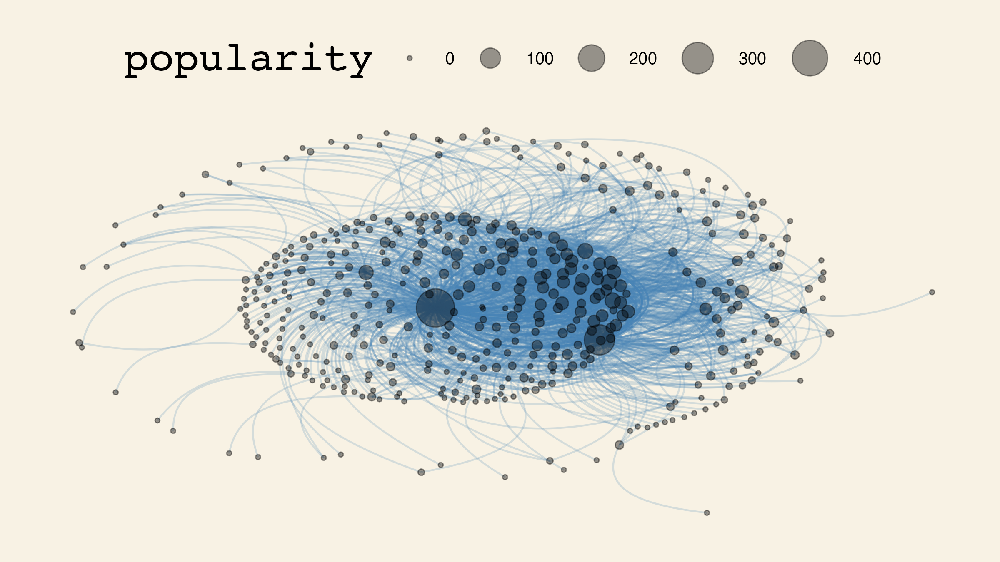
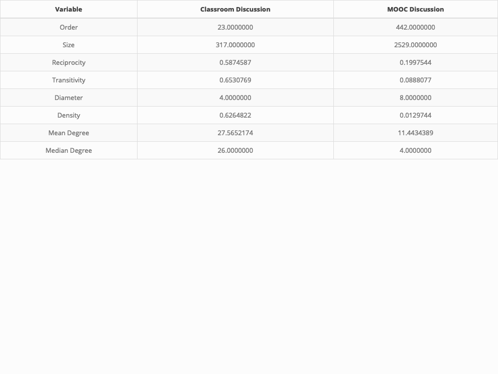

```{r setup, include=FALSE}
options(htmltools.dir.version = FALSE)

library(knitr)
library(tidyverse)
library(xaringan)
library(fontawesome)
library(igraph)
library(tidygraph)
library(ggraph)
library(ggthemes)
library(cowplot)
library(kableExtra)
```

class: inverse, center, middle

# `r fa("fas fa-diagram-project", fill = "#fff")` <br><br> **Part 3b:** <br> MOOC Network

**Data source:** [Massively Open Online Course for Educators (MOOC-Ed) network dataset](https://dataverse.harvard.edu/dataset.xhtml;jsessionid=9ad052693563b29056a88d490182?persistentId=doi%3A10.7910%2FDVN%2FZZH3UB&version=&q=&fileTypeGroupFacet=&fileAccess=&fileSortField=name&fileSortOrder=desc)

---

# `r fa("fas fa-diagram-project", fill = "#fff")` MOOC Network data

```{r}
edgelist2 <- 
  read_csv("data/DLT1 Edgelist.csv", 
           show_col_types = FALSE) %>%
  group_by(Sender, Receiver) %>% 
  mutate(Weight = n()) %>%
  ungroup() %>%
  relocate(Sender, Receiver, Weight)
glimpse(edgelist2)
```

---

# `r fa("fas fa-diagram-project", fill = "#fff")` Class Network data

```{r}
head(edgelist2, 10)
```

---

class: inverse, center, middle

# `r fa("fas fa-otter", fill = "#fff")` <br><br> Try it Out! 

---

# `r fa("fas fa-otter", fill = "#fff")` Try it Out!

What do you think this code will do?

```{r, message=FALSE, warning=FALSE}
network_graph2 <-
  tidygraph::as_tbl_graph(edgelist2) %>%
  mutate(popularity = centrality_degree(mode = 'in'))
network_graph2
```

---

# `r fa("fas fa-otter", fill = "#fff")` Try it Out!

What do you think this code will do?

```{r, message=FALSE, warning=FALSE}
network_graph2 %>%
  ggraph(layout = 'kk')
```

---

# `r fa("fas fa-otter", fill = "#fff")` Try it Out!

What do you think this code will do?

```{r, message=FALSE, warning=FALSE}
network_graph2 %>%
  ggraph(layout = 'kk') +
  geom_edge_arc()
```

---

# `r fa("fas fa-otter", fill = "#fff")` Try it Out!

What do you think this code will do?

```{r, message=FALSE, warning=FALSE}
network_graph2 %>%
  ggraph(layout = 'kk') +
  geom_edge_arc() +
  geom_node_point()
```

---

# `r fa("fas fa-otter", fill = "#fff")` Try it Out!

What do you think this code will do?

```{r, message=FALSE, warning=FALSE}
network_graph2 %>%
  ggraph(layout = 'kk') +
  geom_edge_arc() +
  geom_node_point(alpha = .4, aes(size = popularity)) +
  scale_size(range = c(1,10))
```

---

# `r fa("fas fa-otter", fill = "#fff")` Try it Out!

What do you think this code will do?

```{r, message=FALSE, warning=FALSE}
network_graph2 %>%
  ggraph(layout = 'kk') +
  geom_edge_arc(alpha = .2, 
                width = .5, 
                strength = .5,
                color = 'steelblue') +
  geom_node_point(alpha = .4, aes(size = popularity)) +
  scale_size(range = c(1,10))
```

---

# `r fa("fas fa-otter", fill = "#fff")` Try it Out!

What do you think this code will do?

```{r, message=FALSE, warning=FALSE}
sociogram2 <-
  network_graph2 %>%
  ggraph(layout = 'kk') +
  geom_edge_arc(alpha = .2, 
                width = .5, 
                strength = .5,
                color = 'steelblue'
  ) +
  geom_node_point(alpha = .4, aes(size = popularity)) +
  scale_size(range = c(1,10)) +
  theme_wsj() + 
  scale_colour_wsj("colors6") +
  theme(axis.line=element_blank(),
        axis.text.x=element_blank(), axis.text.y=element_blank(),
        axis.ticks.x =element_blank(), axis.ticks.y =element_blank(),
        axis.title.x=element_blank(), axis.title.y=element_blank(),
        panel.background=element_blank(), panel.border=element_blank(),
        panel.grid.major=element_blank(), panel.grid.minor=element_blank())
sociogram2
```

---

# `r fa("fas fa-otter", fill = "#fff")` Picture it!

```{r, include=FALSE, eval=FALSE}
ggsave(sociogram2, file="output/3-mooc-network.png", width=8, height=4.5)
```

```{r, out.width="600px", echo=FALSE, fig.align="center"}

```

---

# `r fa("fas fa-otter", fill = "#fff")` Look closer!

**MOOC Discussion - Social Network Analysis**

There are quite a few descriptive measures of networks:

- **Order:** number of nodes/vertices (students, in this case)
- **Size:** number of edges/connections (responses, in this case)
- **Reciprocity:** mutuality
- **Transitivity:** clustering
- **Diameter:** similar to degrees of separation
- **Density:** out of all possible connections, percentage that have been made
- **Node degree:** number of connections
- **Sentiment score:** how positive or negative in aggregate
- Character count, Word count, Length of threads

---

# `r fa("fas fa-otter", fill = "#fff")` Look closer!

**Order:** number of nodes/vertices (students, in this case)

```{r}
library(igraph)
gorder(network_graph2)
```

<hr>

**Size:** number of edges/connections (responses, in this case)

```{r}
gsize(network_graph2)
```

---

# `r fa("fas fa-otter", fill = "#fff")` Look closer!

**Reciprocity:** mutuality

```{r}
reciprocity(network_graph2)
```

<hr>

**Transitivity:** clustering

```{r}
transitivity(network_graph2)
```

---

# `r fa("fas fa-otter", fill = "#fff")` Look closer!

**Diameter:** similar to degrees of separation

```{r}
diameter(network_graph2)
```

<hr>

**Density:** out of all possible connections, percentage that have been made

```{r}
edge_density(network_graph2)
```

---

# `r fa("fas fa-otter", fill = "#fff")` Look closer!

**Node degree:** number of connections

```{r}
mean(degree(network_graph2))
```

<hr>

```{r}
degree(network_graph2) %>% mean()
```

<hr>

```{r}
median(degree(network_graph2))
```

---

# `r fa("fas fa-diagram-project", fill = "#fff")` MOOC Network data

```{r}
nodes2 <- 
  read_csv("data/DLT1 Nodes.csv", show_col_types = FALSE)
glimpse(nodes2)
```

---

# `r fa("fas fa-diagram-project", fill = "#fff")` MOOC Network data

```{r}
head(nodes2, 10)
```

---

class: inverse, center, middle

# `r fa("fas fa-diagram-project", fill = "#fff")` <br><br> Comparing <br> Class & MOOC Discussion

---

# `r fa("fas fa-otter", fill = "#fff")` Picture it!

```{r, include=FALSE}
edgelist1 <- 
  read_csv("data/edgelist.csv", 
           show_col_types = FALSE) %>%
  mutate(group = week,
         week = substr(week, 1, 1)
         ) %>% 
  group_by(from, to) %>% 
  mutate(weight = n())
```

```{r, message=FALSE, warning=FALSE, include=FALSE}
network_graph1 <-
  tidygraph::as_tbl_graph(edgelist1) %>%
  mutate(popularity = centrality_degree(mode = 'in'))
network_graph1
```

```{r, message=FALSE, warning=FALSE, include=FALSE}
sociogram1 <-
  network_graph1 %>%
  ggraph(layout = 'kk') +
  geom_edge_arc(alpha = .2, 
                width = .5, 
                strength = .5,
                color = 'steelblue'
  ) +
  geom_node_point(alpha = .4, aes(size = popularity)) +
  scale_size(range = c(1,10)) +
  theme_wsj() + 
  scale_colour_wsj("colors6") +
  theme(axis.line=element_blank(),
        axis.text.x=element_blank(), axis.text.y=element_blank(),
        axis.ticks.x =element_blank(), axis.ticks.y =element_blank(),
        axis.title.x=element_blank(), axis.title.y=element_blank(),
        panel.background=element_blank(), panel.border=element_blank(),
        panel.grid.major=element_blank(), panel.grid.minor=element_blank())
```

```{r, out.width = "540px", echo = FALSE, fig.align = "center"}
sociogram1_2 <- 
  cowplot::plot_grid(sociogram1, sociogram2, 
                     ncol = 1,
                     labels = c("Example 1 (Classroom)", "Example 2 (MOOC)"))
```

```{r, include=FALSE, eval=FALSE}
ggsave(sociogram1_2, file = "output/3-both-networks.png", width = 8, height = 8)
```

```{r, out.width="540px", echo=FALSE, fig.align="center"}
include_graphics("output/3-both-networks.png")
```

---

# `r fa("fas fa-otter", fill = "#fff")` Picture it!

```{r, message=FALSE, include=FALSE}
names <- 
  c("Order", "Size", "Reciprocity", "Transitivity",
    "Diameter", "Density", "Mean Degree", "Median Degree")
measures1 <- 
  c(gorder(network_graph1), gsize(network_graph1), 
    reciprocity(network_graph1), transitivity(network_graph1),
    diameter(network_graph1), edge_density(network_graph1),
    mean(degree(network_graph1)), median(degree(network_graph1))
  )
measures2 <-
  c(gorder(network_graph2), gsize(network_graph2), 
    reciprocity(network_graph2), transitivity(network_graph2),
    diameter(network_graph2), edge_density(network_graph2),
    mean(degree(network_graph2)), median(degree(network_graph2))
  )
comparison <-
  names %>%
  bind_cols(measures1) %>%
  bind_cols(measures2)

comparison_kable <- 
  comparison %>% 
  kable(align='c',
        col.names = c("Variable", "Classroom Discussion", "MOOC Discussion")
        ) %>% 
  kable_styling(c("striped", "bordered"))
save_kable(comparison_kable, "output/3-comparison-table.png")  # requires webshot::install_phantomjs()
```

```{r, out.width="100%", echo=FALSE, fig.align="center"}

```

---

class: inverse, center, middle

# `r fa("fas fa-code", fill = "#fff")` <br><br> Try on your own!

---

# `r fa("fas fa-code", fill = "#fff")` Try on your own!

- Download a copy of this repository.
- Use the saved data in the "data" folder to play around a bit more, changing different parameters.
- Reflect: 
  - What other comparisons might you make?
  - How else might you analyze these data?

---

class: inverse, center, middle

# `r fa("fas fa-list", fill = "#fff")` <br><br> Appendix: <br> Helpful Resources <br> and Troubleshooting

---

# Resources

```{r child="notes/resources.Rmd"} 
```

---

# Troubleshooting

```{r child="notes/troubleshooting.Rmd"} 
```
